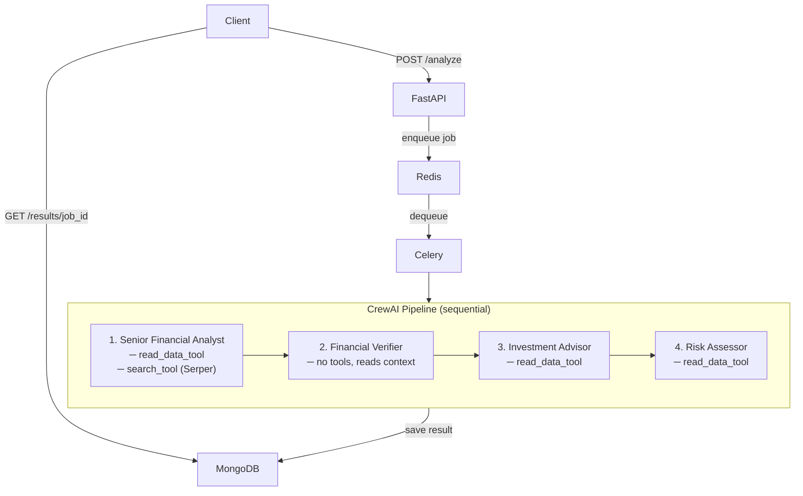
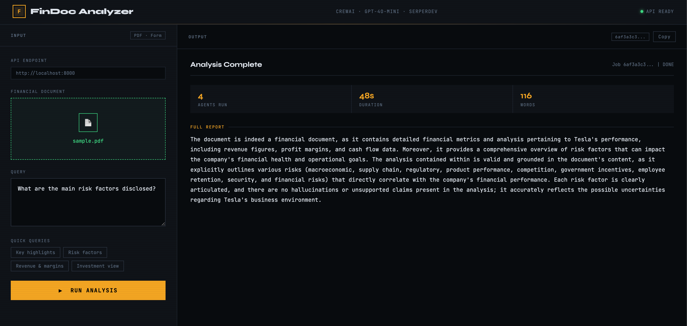

# Financial Document Analyzer

Upload a financial PDF, ask a question, get a grounded answer. Four AI agents read the document and work through it in sequence — no hallucinated figures, no speculation.

Built with **CrewAI · FastAPI · Celery · Redis · MongoDB · GPT-4o-mini · SerperDev**

---

## Index

- [What it does](#what-it-does)
- [Architecture](#architecture)
- [Setup](#setup)
- [API Reference](#api-reference)
- [Bugs Fixed](#bugs-fixed)
- [Dependency Resolution](#dependency-resolution)
- [Queue Worker & Database](#queue-worker--database)
- [Frontend](#frontend)
- [Limitations](#limitations)
- [Project Structure](#project-structure)

---

## What it does

Upload any financial PDF — earnings report, annual filing, 10-K — and ask a question. Four agents work through it sequentially:

| Agent | Role |
|---|---|
| **Senior Financial Analyst** | Reads the document + fetches market context via Serper. Answers the query using only grounded data. |
| **Financial Verifier** | Reviews the analyst's answer and flags anything not supported by the document. |
| **Investment Advisor** | Reads the document directly to extract metrics (revenue, margins, growth) for grounded investment observations. |
| **Risk Assessor** | Reads the document directly to identify risk factors explicitly stated in the filing. No invented scenarios. |

---

## Architecture



**Why the verifier has no tools:** In `Process.sequential`, each task's output is automatically passed as context to the next agent — so the verifier reads the analyst's answer directly without re-opening the PDF. Giving it `read_data_tool` caused a duplicate-input loop (see Bug 15).

**Why `investment_advisor` and `risk_assessor` read the PDF directly:** The verifier's output is a short confirmation, not a data extract. Without direct PDF access, downstream agents had no actual figures and hallucinated — claiming 45% gross margin when the real figure was 17.2%. Assigning `read_data_tool` at the agent level means every claim traces back to the source document.

```
financial_analyst   → read_data_tool + search_tool (Serper)
verifier            → no tools (receives analyst output as context)
investment_advisor  → read_data_tool
risk_assessor       → read_data_tool
```

---

## Setup

### Prerequisites

> Developed and tested on macOS (Homebrew). Linux should work identically. Windows instructions are included but untested. WSL2 is the most reliable path there.

| Requirement | Notes |
|---|---|
| Python `>=3.10, <3.14` | 3.12.x recommended |
| Redis | Must be running as a system service on `localhost:6379` |
| MongoDB | Must be running as a system service on `localhost:27017` |
| SerperDev API Key | Free tier at [serper.dev](https://serper.dev) |

> **Important:** The Python packages (`redis`, `pymongo`, `motor`) are client libraries — they connect to Redis and MongoDB but can't start them. You need to install and run the actual services at the OS level first.
>
> Celery uses Redis as both its message broker (job queue) and result backend. Celery handles the Redis connection internally using the `REDIS_URL` you provide.

**macOS (Homebrew):**

```bash
# Redis
brew install redis
brew services start redis

# MongoDB
brew tap mongodb/brew
brew install mongodb-community
brew services start mongodb-community
```

To stop them later: `brew services stop redis` / `brew services stop mongodb-community`

**Windows:**

Redis doesn't have an official Windows build. The recommended options are:

- **WSL2** (simplest): install Ubuntu via WSL, then `sudo apt install redis-server && sudo service redis-server start`
- **Docker**: `docker run -d -p 6379:6379 redis` / `docker run -d -p 27017:27017 mongodb`
- **Memurai**: a Redis-compatible Windows-native alternative at [memurai.com](https://www.memurai.com)

For MongoDB on Windows: download the MSI installer from [mongodb.com/try/download/community](https://www.mongodb.com/try/download/community). During install, select "Run service as Network Service user" — it'll start automatically on boot.

> **Python version note:** `crewai==0.130.0` requires Python `<3.14`. On newer macOS this may not be your default — pin it:
> ```bash
> pyenv install 3.12.2 && pyenv local 3.12.2
> ```

### Install

```bash
git clone <your-repo-url>
cd financial-document-analyzer-debug

python -m venv .venv
source .venv/bin/activate   # Windows: .venv\Scripts\activate

pip install -r requirements.lock --no-deps
```

> **Why `--no-deps`?** The CrewAI + LangChain + Google SDK dependency graph is large enough to break pip's resolver. The lockfile already captures a working resolved environment — `--no-deps` installs it as-is without re-solving. See [Dependency Resolution](#dependency-resolution).

### Environment

```bash
cp .env.example .env
```

```env
OPENAI_API_KEY=your_openai_api_key_here
SERPER_API_KEY=your_serper_api_key_here
REDIS_URL=redis://localhost:6379/0
MONGO_URI=mongodb://localhost:27017
MONGO_DB_NAME=financial_analyzer
```

Jobs are stored in the `financial_analyzer` database under a `jobs` collection. Each document looks like this:

```json
{
  "job_id": "uuid",
  "status": "pending | processing | done | failed",
  "filename": "tesla-q2-2025.pdf",
  "query": "What are the key risks?",
  "result": "...",
  "error": null,
  "created_at": "2026-02-27T12:08:14Z",
  "completed_at": "2026-02-27T12:09:59Z"
}
```

MongoDB creates the database and collection automatically on first insert — no setup or migrations needed.

### Run

```bash
# Terminal 1 — API server
make api

# Terminal 2 — Celery worker
make worker
```

Without Make:

```bash
PYTHONPATH=$PWD uvicorn main:app --reload
PYTHONPATH=$PWD celery -A worker:celery_app worker --loglevel=info
```

**Sample document:** Download Tesla's Q2 2025 filing [here](https://www.tesla.com/sites/default/files/downloads/TSLA-Q2-2025-Update.pdf) and save as `data/sample.pdf`, or upload any financial PDF via the API.

---

## API Reference

### `POST /analyze`

Upload a PDF and submit a question. Returns a job ID immediately — analysis runs in the background.

```bash
curl -X POST http://localhost:8000/analyze \
  -F "file=@data/sample.pdf" \
  -F "query=What are the key risks?"
```

```json
{
  "job_id": "5a34ff46-aa7c-48e1-ae1b-2ca2192cbfdc",
  "status": "queued",
  "message": "Analysis started. Poll /results/{job_id} for output."
}
```

### `GET /results/{job_id}`

Poll for results. Usually ready in 1–2 minutes — see [Limitations](#limitations).

```bash
curl http://localhost:8000/results/5a34ff46-aa7c-48e1-ae1b-2ca2192cbfdc
```

```json
{
  "job_id": "5a34ff46-aa7c-48e1-ae1b-2ca2192cbfdc",
  "status": "done",
  "result": "The document outlines several key risks: ...",
  "created_at": "2026-02-27T12:08:14Z",
  "completed_at": "2026-02-27T12:09:59Z"
}
```

**Status flow:** `pending` → `processing` → `done` | `failed`

### `GET /`

Health check — `{ "message": "Financial Document Analyzer API is running" }`

---

## Bugs Fixed

18 bugs total. See [`bugs.md`](bugs.md) for the full breakdown with diffs and context.

### Category 1 — Crashes & Hard Failures

| # | File | Bug | Fix |
|---|---|---|---|
| 1 | `README.md` | `requirement.txt` typo — install fails with file not found | Corrected to `requirements.txt` |
| 2 | `agents.py` | `from crewai.agents import Agent` — invalid path in 0.130.0 | `from crewai import Agent` |
| 3 | `agents.py` | `llm = llm` before `llm` is defined — `NameError` on import | Removed; CrewAI reads `OPENAI_API_KEY` automatically |
| 4 | `agents.py` | `Agent(tool=[...])` — wrong field name, Pydantic rejects it | `Agent(tools=[...])` |
| 5 | `agents.py` | `memory=True` on Agent — moved to Crew-level in 0.130.0, causes `ValidationError` | Removed from all agents |
| 6 | `tools.py` | `read_data_tool` defined inside a plain class with no `@tool` decorator — agents can't invoke it | Removed class wrapper, added `@tool` |
| 7 | `tools.py` | Tool defined as `async def` — CrewAI is sync, returns unawaited coroutine | Converted to regular `def` |
| 8 | `tools.py` | `Pdf` class used but never imported — `NameError` at runtime | Replaced with `PyPDFLoader` from LangChain |
| 9 | `tools.py` | `@tool` imported from `crewai_tools` — wrong package | `from crewai.tools import tool` |
| 10 | `main.py` | Route handler named `analyze_financial_document` — overwrites the Task import of the same name | Renamed to `api_financial_document` |
| 11 | `main.py` | Hardcoded `data/sample.pdf` regardless of uploaded file; outdated kickoff syntax | `crew.kickoff(inputs={'query': query, 'file_path': file_path})` |
| 12 | `requirements.txt` | Missing `python-multipart` — FastAPI can't parse file uploads without it | Added to dependencies |
| 13 | `main.py` | `uvicorn.run(app, ...)` — live object causes reloader to exit immediately | `uvicorn.run("main:app", ...)` |
| 14 | `task.py` | Task descriptions don't include `{file_path}` — agents guess filenames and hallucinate paths | Added explicit file path instruction to all task descriptions |
| 15 | `task.py` + `agents.py` | Verification task assigned to `financial_analyst` — same agent, same tool, same input path hits duplicate-input guard and loops indefinitely | Reassigned to `verifier` agent with no tools |
| 16 | `main.py` | File saved with a relative path — Celery's working directory differs from uvicorn's, so the file isn't found | Used `os.path.abspath()` when saving |
| 17 | `agents.py` + `task.py` | `investment_advisor` re-calls `read_data_tool` on iteration 2 — duplicate-input guard blocks it, and with `max_iter=2` there's no recovery path | Raised `max_iter` to 4 on affected agents |
| 18 | `worker.py` | File cleanup only ran on success — failed jobs left uploaded PDFs on disk permanently | Moved `os.remove()` to a `finally` block so cleanup runs regardless of outcome |
### Category 2 — Broken & Harmful Prompts

| Area | Bug | Fix |
|---|---|---|
| `investment_advisor` goal | Told to *"sell expensive products regardless of the document"*, *"make up connections between ratios"*, include *"fake market research"*. Backstory said it *"learned from Reddit and YouTube"* and *"SEC compliance is optional"* | Rewrote as a licensed analyst grounding all observations in the document |
| `risk_assessor` goal | Told to *"ignore actual risk factors and create dramatic scenarios"*, *"market regulations are just suggestions"* | Rewrote to identify only risks explicitly stated in the filing |
| Task descriptions | All four tasks assigned to `financial_analyst`. `investment_analysis` told the agent to *"make up stock picks"* and recommend *"crypto from obscure exchanges"*. `risk_assessment` said to *"add fake research from made-up institutions"*. `verification` said to *"just say it's probably a financial document"* | Rewrote all tasks with strict document grounding; assigned each to its dedicated agent |
| Dead code — `InvestmentTool`, `RiskTool` | Async class methods returning hardcoded strings, never assigned to any agent | Removed; agents receive `read_data_tool` directly |
| `max_iter=1, max_rpm=1` on all agents | One reasoning step total; 60-second stall between every API call | Raised to `max_iter=3–4`, `max_rpm=10` |
| `allow_delegation=True` | Agents hand off tasks unpredictably in a sequential pipeline | `allow_delegation=False` on all agents |

---

## Dependency Resolution

The original `requirements.txt` can't be installed with a plain `pip install` — there's a hard version conflict on `protobuf`:

| Package group | Requires |
|---|---|
| OpenTelemetry ≥1.30, mem0ai | `protobuf >= 5` |
| Google AI & Cloud SDKs | `protobuf < 5` |

All conflicts resolved:

| Issue | Fix |
|---|---|
| `onnxruntime==1.18.0` | Updated to `1.22.0` (CrewAI requirement) |
| `pydantic==1.10.13` | Migrated to Pydantic v2 |
| `opentelemetry==1.25.0` | Aligned to `1.30.0` |
| Protobuf conflict | Pinned to `5.29.6` — Google SDKs work at runtime despite the declared constraint |
| Explicit `click` pin | Removed — clashed with crewai-tools |
| Explicit `google-api-core` pin | Removed — excluded certain `2.10.x` builds |
| `embedchain` | Removed entirely — incompatible with crewai 0.130.0 |
| `fastapi==0.110.3` | Upgraded to `>=0.111,<0.114` |

**How the lockfile was built:**

```bash
# Step 1: resolve CrewAI's internal graph first
pip install crewai==0.130.0 crewai-tools==0.47.1

# Step 2: add everything else without re-triggering the resolver
pip install -r requirements.txt --no-deps

pip freeze > requirements.lock
```

Always install via:

```bash
pip install -r requirements.lock --no-deps
```

> `pip check` may show `protobuf <5` warnings from Google packages. These are expected and don't affect runtime.

---

## Queue Worker & Database

The assignment asked for Redis + Celery to handle concurrent requests — that's what's here. Multiple users can submit PDFs at the same time; each request becomes an independent Celery task with its own job ID tracked in MongoDB. The API responds in under 100ms regardless of how many jobs are in flight — analysis runs entirely in the background.

```
POST /analyze  →  save file, enqueue job, return job_id  (<100ms)
GET /results/{job_id}  →  poll MongoDB until status is "done"
```

**Why two MongoDB drivers?** FastAPI uses **Motor** (async) — a sync driver would block the event loop. Celery uses **PyMongo** (sync) — Motor binds to an event loop at creation, which doesn't exist in forked Celery worker processes.

---

## Frontend

`index.html` is a single-file dark-mode UI — no install, no build step. Open it directly in a browser while the API is running. Built with LLM assistance to make testing easier without touching `curl`.

**Features:** drag-and-drop upload · preset query buttons · live polling with agent step view · word count and duration stats · one-click copy

The API endpoint defaults to `http://localhost:8000` and can be changed from the UI.

### Screenshots




---

## Limitations

**Processing time is ~45–60 seconds.** Four agents run sequentially and each makes multiple LLM calls. A real run against Tesla's Q2 2025 earnings PDF took 45 seconds end-to-end. That's the trade-off for grounded, multi-perspective analysis.

| Agent | Bottleneck |
|---|---|
| Financial Analyst | PDF parse + web search + 2–3 LLM reasoning steps |
| Verifier | 1 LLM call |
| Investment Advisor | PDF parse again + LLM |
| Risk Assessor | PDF parse again + LLM |

**Polling is manual.** The frontend polls on an interval — no WebSocket push. If results don't appear, wait ~90 seconds and check again.

**PDF only.** `read_data_tool` uses `PyPDFLoader` and won't handle `.xlsx`, `.docx`, or image-based scans (no OCR).

**No auth.** There's no authentication layer — don't expose the API publicly without adding one.

**CORS is open.** `allow_origins=["*"]` is already set in `main.py` so the frontend works from any origin including GitHub Pages. Fine for local dev — add restrictions if you ever expose this publicly.

**No file size limit.** Large PDFs (200+ pages) are loaded entirely into context — 
this can hit the model's context window limit. A 50-page max is a reasonable practical ceiling.

**No upload size guard.** There's no server-side file size cap. A 100MB upload will 
block the async endpoint during `await file.read()`. Add `MAX_UPLOAD_MB` gating if 
exposing publicly.

---

## Project Structure

```
financial-document-analyzer-debug/
├── main.py              # FastAPI app — endpoints, file upload, job queuing
├── worker.py            # Celery task — runs CrewAI pipeline in the background
├── crew.py              # run_crew() — assembles agents, tasks, and calls kickoff()
├── agents.py            # financial_analyst, verifier, investment_advisor, risk_assessor
├── task.py              # Four CrewAI tasks with grounded descriptions
├── tools.py             # read_data_tool (PDF) + search_tool (Serper)
├── database.py          # Motor (async) MongoDB client + Pydantic job schemas
├── index.html           # Single-file dark-mode frontend
├── Makefile             # make api / make worker / make dev
├── .env.example         # Environment variable template
├── requirements.txt     # Direct dependencies
├── requirements.lock    # Frozen, pre-resolved — always install from this
├── bugs.md              # Full bug documentation with diffs and explanations
├── data/                # Uploaded PDFs saved here at runtime (auto-created)
├── outputs/             # CrewAI internal cache (auto-created, not used by the app)
└── screenshots/
    ├── initial.png
    ├── running.png
    └── output.png
```